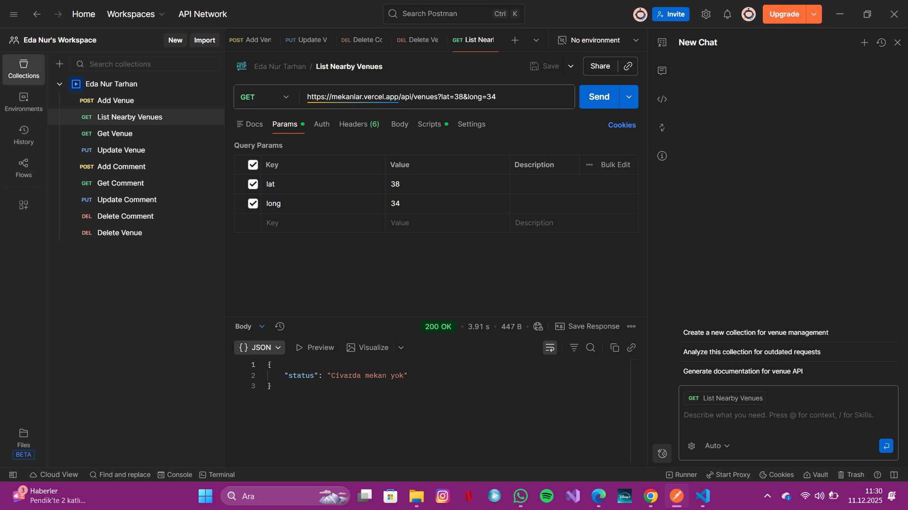
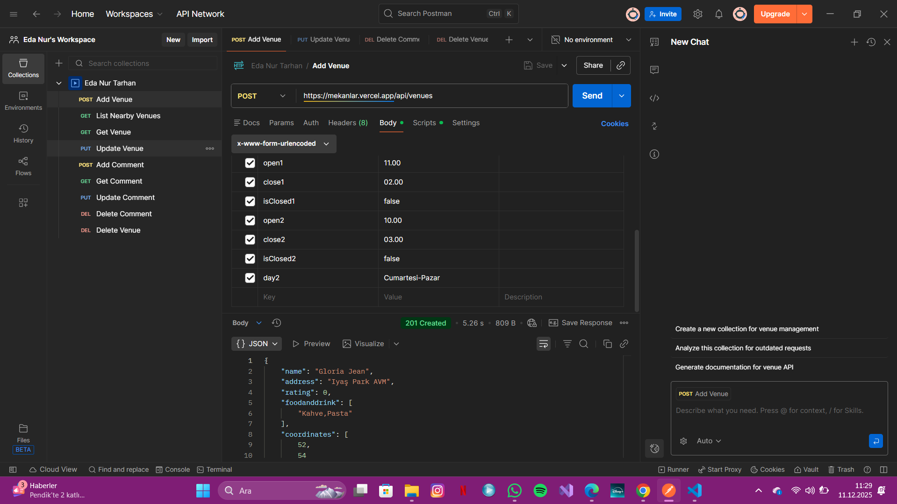
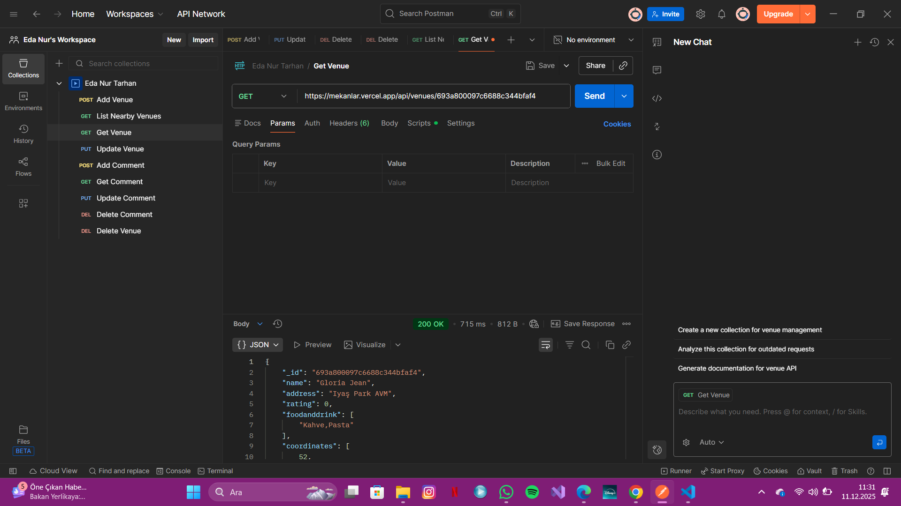
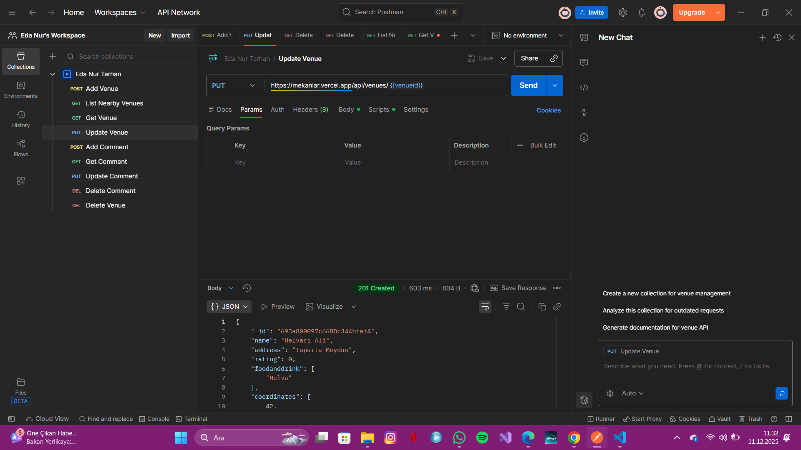
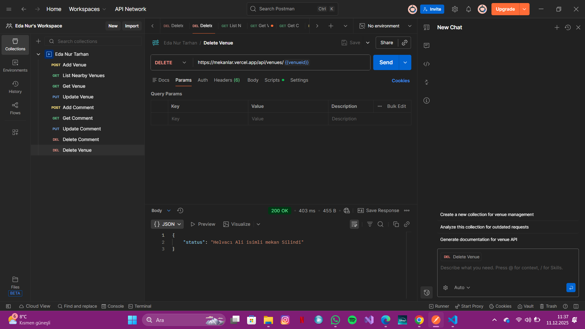
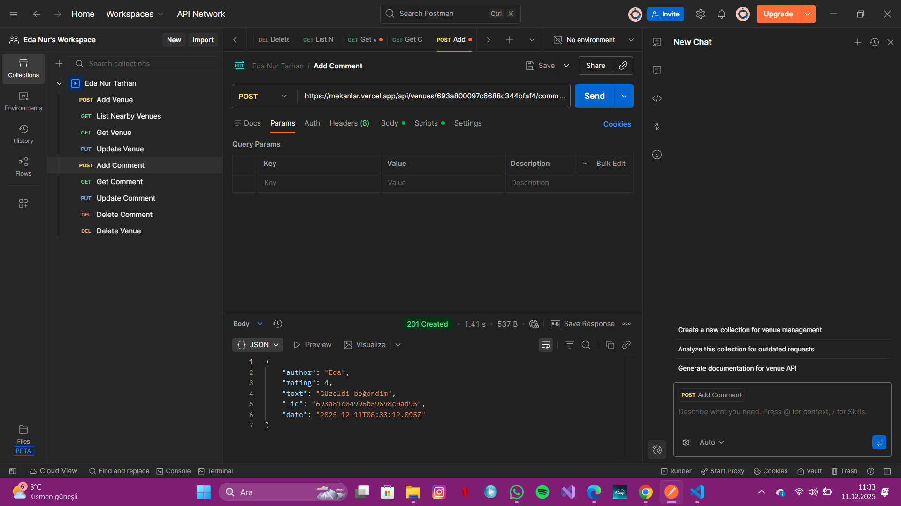
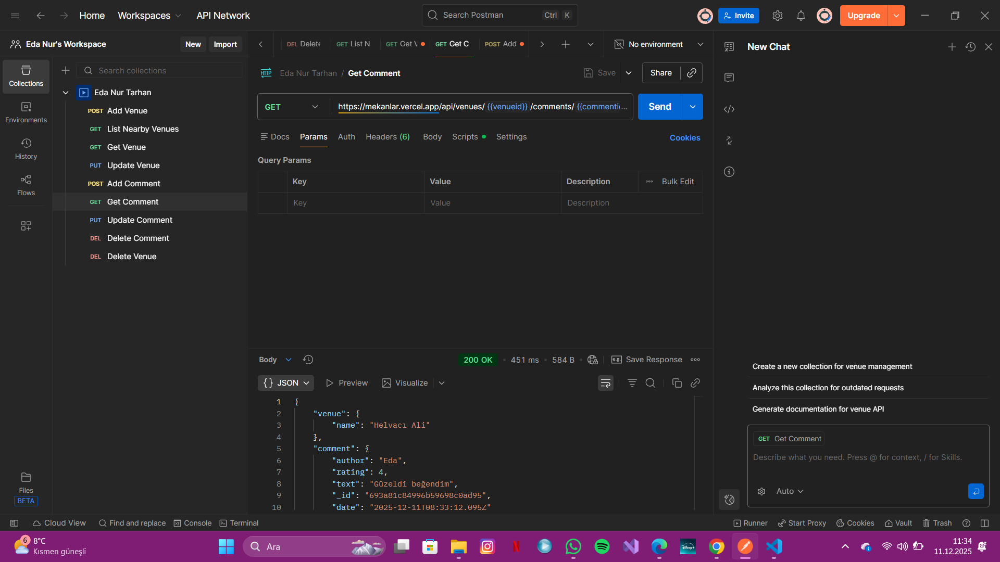
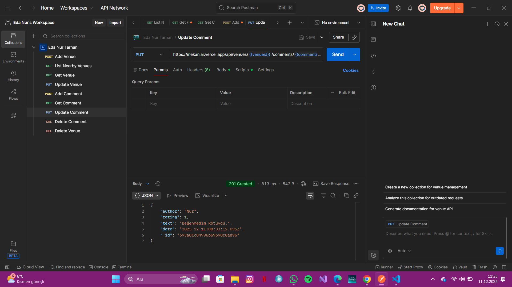

MEKANBUL BACKEND

Bu repo, web Twknolojileri ve Programlama kapsamında geliştirilen uygulamanın backend tarafıdır.

🔗  [mekanlar.vercel.app]


Bu API; mekan (venue) verilerini yönetir: listeleme, ekleme, güncelleme, görüntüleme ve silme (CRUD) işlemlerini gerçekleştirir.


* Node.js & Express.js
* MongoDB Cloud (Veritabanı)


Projeyi yerel ortamınızda çalıştırmak için aşağıdaki adımları izleyin:

1. Repoyu klonlayın veya indirin.
2. Proje dizinine gidin:
   ```bash
   cd proje-klasoru-adi

3. Gerekli paketleri yükleyin:
   npm install

Projeyi başlatmak için:
  npm start


  API Uç Noktaları (Endpoints)

**Mekan İşlemleri**
* **Mekan Ekle:** `POST /api/venues`
* **Yakındaki Mekanları Listele:** `GET /api/venues?lat={enlem}&long={boylam}`
* **Mekan Detayı Getir:** `GET /api/venues/:venueid`
* **Mekan Güncelle:** `PUT /api/venues/:venueid`
* **Mekan Sil:** `DELETE /api/venues/:venueid`

**Yorum İşlemleri**
* **Yorum Ekle:** `POST /api/venues/:venueid/comments`
* **Yorum Getir:** `GET /api/venues/:venueid/comments/:commentid`
* **Yorum Güncelle:** `PUT /api/venues/:venueid/comments/:commentid`
* **Yorum Sil:** `DELETE /api/venues/:venueid/comments/:commentid`


##  Ekran Görüntüleri (Screenshots)

Aşağıda API uç noktalarının test sonuçları yer almaktadır.

###  Mekan İşlemleri (Venue Endpoints)

**1. Yakındaki Mekanları Listeleme**


**2. Mekan Ekleme**


**3. Mekan Getirme**


**4. Mekan Güncelleme**


**5. Mekan Silme**


---

###  Yorum İşlemleri (Comment Endpoints)

**1. Yorum Ekleme**


**2. Yorum Getirme**


**3. Yorum Güncelleme**


**4. Yorum Silme**


Bu proje Eda Nur TARHAN tarafından Web Teknolojileri ve Programlama dersi için hazırlanmıştır.

